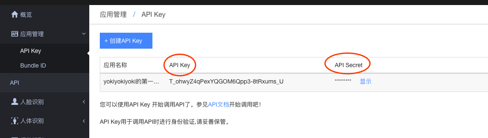

<h2 align="center">人脸融合简单demo </h2>

# 目录

- [说明](#说明)
- [快速入门](#快速入门)
  - [安装](#安装)
  - [教程](#教程)
- [License](#license)


## 说明

- 基于 face++ ai 人脸识别接口，人脸融合简单 demo

## 快速入门

### 安装

```bash            
$ npm i
$ npm run start         
```
打开浏览器输入：localhost：3000

目录说明:

```
├─ public         //前端资源
    ├─files       //文件用来存放上传文件
├─ routes         //路由
├─ views          //模板文件

```
### 教程

##### 搭建一个express工程

```bash
$ npm init         //初始化工程
参考package.json复制过来,直接npm install
"dependencies": {
    "axios": "^0.18.0",
    "baidu-aip-sdk": "^2.3.9",
    "body-parser": "~1.17.1",
    "cookie-parser": "~1.4.3",
    "debug": "~2.6.3",
    "ejs": "~2.5.6",
    "express": "~4.15.2",
    "morgan": "~1.8.1",
    "multiparty": "latest",
    "serve-favicon": "~2.4.2"
}
```
- 在目录下新建public文件夹(放前端静态资源，css/js/image/files)
- 在目录下新建app.js，编写基础代码(具体参见app.js内部)
```javascript
app.js主要代码

/* 引入路由文件*/
var index = require("./routes/index");

/* 新建一个express实例*/
var app = express();

/* 使用ejs作为模板 */
app.set("views", path.join(__dirname, "views"));
app.set("view engine", "ejs");

/* 前端可以访问静态资源，文件夹是public */
app.use(express.static("public"));

/* 访问首页 */
app.use("/", index);

/* 监听3000端口 */
app.listen(3000, () => {
  console.log("app listening on port 3000!");
});
```
- 在目录下新建routes文件夹，新建index.js（express路由）
```javascript
index.js主要代码

var express = require("express");
var router = express.Router();
/* 测试一下get和post请求 */
router.get("/", function(req, res, next) {
  res.render("index", { title: "Express" });
});
router.post("/", function(req, res, next) {
  res.send("UFace post ok");
});
```
- 在目录下新建views文件夹，新建index.ejs,编写前端主要代码（express模板）
```html
<!DOCTYPE html>
<html>
  <head>
    <title>face测试</title>
    <!-- public文件夹下css/style -->
    <link rel="stylesheet" href="/css/style.css" />
  </head>
  <body>
    <h1>随便测试</h1>
    <p>上传face</p>
    <form id="uface">
      <input type="file" name="files" id="upload" />
      <!-- 点击上传函数 -->
      <button type="button" onClick="mergeImg()">submit</button>
    </form>

    <div class="outer">
        <!-- 合成的图片占位符 -->
      
      <canvas id="canvas" width="713" height="578"></canvas>
    </div>

    <!-- 引进jquery，方便操作 -->
    <script src="https://cdn.bootcss.com/jquery/3.2.1/jquery.min.js"></script>
    <!-- public文件夹下js/index -->
    <script src="/js/index.js"></script>
  </body>
</html>

```

##### 上传图片

- 前端js编写
```javascript
function mergeImg() {
    /*变成form对象上传*/
  var formData = new FormData();
  formData.append("file", $("#upload")[0].files[0]);
  $.ajax({
    type: "POST",
    /* 后端接收路由，下面会说到 */
    url: "/file/merge/uploading",
    data: formData,
    processData: false,
    contentType: false,
    success: function(res) {
      console.log(res);
      /* 返回来的填满前端图片src，然后展示 */
      $("#target")[0].src = "data:image/png;base64," + res.result;
      $("#target").show();
    }
  });
}
```
- 申请face++的FAPI_KEY
    - [face++开放平台](https://www.faceplusplus.com.cn)注册并登陆
    - 找到api key和Secret
    

- 编写后端接口逻辑
```javascript
routes/index.js

/*face++ 的授权，替换成你的*/
let FAPI_KEY = "T_ohwyZ4qPexYQGOM6Qpp3-8tRxums_U";
let FSECRET_KEY = "hlXd8o2G_e_Q6_1FlXvBt09dohPQ9zg-";

let multiparty = require("multiparty");

let fs = require("fs");

router.post("/file/merge/uploading", function(req, res, next) {
    
  var form = new multiparty.Form({
      /* 上传的文件存放 */
    uploadDir: "./public/files/"
  });
    /* multiparty解析form文件*/
  form.parse(req, function(err, fields, files) {
    var filesTmp = JSON.stringify(files, null, 2);

    if (err) {
      console.log("解析错误" + err);
    } else {
      console.log( filesTmp);

      var inputFile = files.file[0];
      var uploadedPath = inputFile.path;

        /* 上传的文件 */
      var imageFace = fs.readFileSync(uploadedPath);
      var base64ImgFace = Buffer.from(imageFace).toString("base64");
        /* 读取模板图，编码成base64 */
        //TODO:以后自己前端上传模板图
      var imageTpl = fs.readFileSync("./public/images/face/timg.jpg");
      var base64ImgTpl = Buffer.from(imageTpl).toString("base64");

        /* 请求face++接口 */
      axios({
        method: "post",
        url: "https://api-cn.faceplusplus.com/imagepp/v1/mergeface",
        data: qs.stringify({
          api_key: FAPI_KEY,
          api_secret: FSECRET_KEY,
          template_base64: base64ImgTpl,
          merge_base64: base64ImgFace
        })
      })
        .then(data => {
          res.send(data.data);
        })
        .catch(e => {
          console.log(e.response.data);
        });
    }
  });
});
```
- 启动
```bash
$ node app.js
```
- 原图

- 效果图


## License

- [MIT](https://opensource.org/licenses/MIT)
